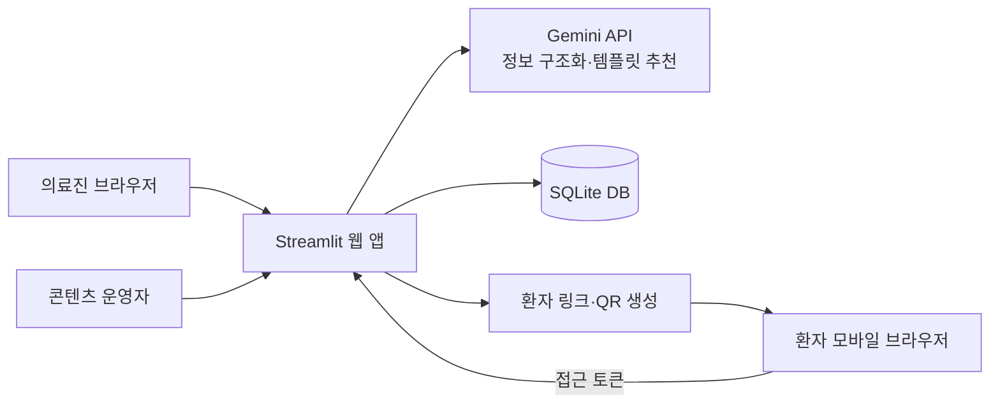
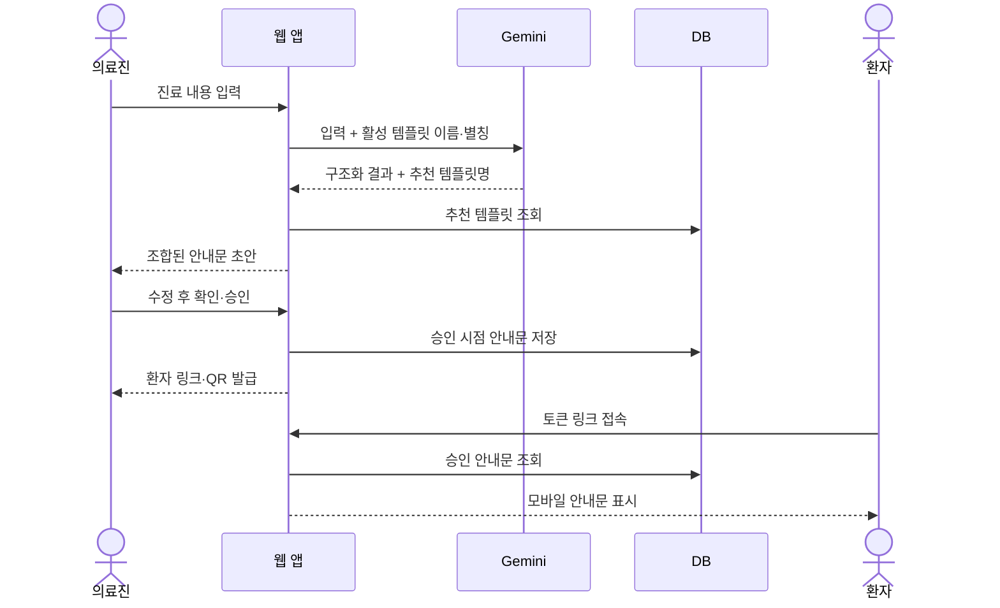

# 응급실 스마트 퇴원 안내 MVP 기술 설계서

- 문서 버전: 0.1
- 작성일: 2026-09-06
- 대상: MVP 1 — 안내문 생성과 전달
- 상태: 이전 Streamlit 설계(참고용)

> 현재 구현은 Next.js와 PostgreSQL 기반으로 전환되었습니다. 최신 구조와 배포 방식은 [웹 전환·Vercel 배포 설계](web-architecture-proposal.md)를 기준으로 합니다.

## 1. 설계 목표

의료진이 입력한 진료 내용을 AI가 구조화하고 DB에 등록된 검수 안내문과 매핑한다. 의료진이 최종 내용을 직접 확인하고 승인한 경우에만 환자용 링크와 QR을 발급한다.

초기 설계는 다음 원칙을 따른다.

- 하나의 Streamlit 애플리케이션으로 운영한다.
- 복잡한 서비스 분리와 비동기 처리는 도입하지 않는다.
- AI 없이도 수동 템플릿 선택과 안내문 발급이 가능해야 한다.
- 안내 콘텐츠와 발급된 안내문은 분리하여 저장한다.
- 배포 환경에 따라 DB와 인증 방식을 교체할 수 있게 경계를 유지한다.

## 2. 시스템 구성



### 구성요소

| 구성요소 | 책임 |
|---|---|
| Streamlit 앱 | 의료진·운영자·환자 화면과 업무 흐름 제공 |
| Gemini API | 입력 내용 구조화와 템플릿명 추천 |
| 질환 콘텐츠 DB | 검수된 복약·생활·재내원 안내 관리 |
| 발급 안내문 DB | 의료진이 승인한 시점의 환자 안내문 보관 |
| QR 생성기 | 환자 URL을 QR PNG로 변환 |

## 3. 화면과 경로

현재 MVP는 단일 앱에서 쿼리 파라미터와 메뉴로 화면을 구분한다.

| 화면 | 접근 방식 | 주요 기능 |
|---|---|---|
| 의료진 화면 | `/` → 퇴원 안내문 작성 | 입력, AI 분석, 템플릿 선택, 수정, 승인, QR 발급 |
| 콘텐츠 관리 | `/` → 질환별 콘텐츠 관리 | 등록, 수정, 활성화, 미리보기 |
| 환자 화면 | `/?id={token}` | 승인된 안내문 읽기 |

배포 환경에서 `APP_PASSWORD`가 설정된 경우 의료진과 콘텐츠 관리 화면은 비밀번호 확인 후 접근한다. 환자 화면은 임의 접근 토큰으로만 접근한다.

## 4. 핵심 업무 흐름



### 실패 시 흐름

- AI 호출 실패: 오류를 표시하고 수동 템플릿 선택을 허용한다.
- AI 추천 불확실: 템플릿을 자동 확정하지 않고 의료진이 선택한다.
- QR 생성 실패: 환자 URL은 계속 표시한다.
- 존재하지 않는 토큰: 안내문이 유효하지 않다는 화면을 표시한다.
- 활성 템플릿 없음: 안내문 생성을 막고 콘텐츠 등록을 안내한다.

## 5. AI 입력·출력 계약

AI에는 환자 식별정보를 넣지 않는 것을 기본으로 한다. MVP에서 AI가 처리하는 정보는 의료진이 입력한 비식별 진료 요약과 활성 템플릿의 이름·별칭이다.

### 입력

```json
{
  "clinical_text": "급성 장염 의심. 복부는 부드럽고 반발통 없음...",
  "templates": [
    {
      "name": "급성 장염",
      "aliases": "장염, 위장염, 설사, 구토"
    }
  ]
}
```

### 출력

```json
{
  "diagnosis": "급성 위장염 의심",
  "template_name": "급성 장염",
  "findings": "복부는 부드럽고 반발통은 없습니다.",
  "medication_note": "위장관 증상 조절약이 처방되었습니다."
}
```

### 제한사항

- 입력에 없는 진단·검사·처방을 생성하지 않는다.
- 생활수칙과 재내원 기준을 AI가 새로 작성하지 않는다.
- `template_name`은 전달된 활성 템플릿명 중 하나 또는 빈 문자열이어야 한다.
- 파싱 또는 검증에 실패한 결과는 자동 승인하지 않는다.

## 6. 데이터 설계

### `disease_templates`

질환별로 사전 검수한 콘텐츠를 저장한다.

| 필드 | 형식 | 설명 |
|---|---|---|
| `id` | INTEGER | 내부 식별자 |
| `name` | TEXT, UNIQUE | 질환명 |
| `aliases` | TEXT | 쉼표로 구분한 검색어·별칭 |
| `medication` | TEXT | 공통 처방·복약 안내 |
| `education` | TEXT | 생활·식이·자가관리 안내 |
| `warning_signs` | TEXT | 즉시 재내원해야 하는 증상 |
| `active` | INTEGER | 진료 화면 사용 여부 |
| `updated_at` | DATETIME | 마지막 수정 시각 |

### `reports`

의료진이 승인한 시점의 안내문 스냅샷을 저장한다.

| 필드 | 형식 | 설명 |
|---|---|---|
| `id` | TEXT | 환자 링크에 사용하는 임의 토큰 |
| `payload` | JSON TEXT | 승인된 안내문 전체 |
| `created_at` | DATETIME | 발급 시각 |

`payload`에 저장할 항목:

- `diagnosis`
- `findings`
- `medication`
- `education`
- `warning_signs`
- `template_id`

발급 이후 원본 템플릿이 수정돼도 기존 환자 안내문은 변경하지 않는다.

## 7. 상태 관리

### 브라우저 세션 상태

다음 값은 작성 중인 화면 상태로만 사용한다.

- 의료진 입력 원문
- AI 구조화 결과
- 적용한 템플릿 ID
- 수정 중인 안내문 초안
- 발급 완료 후 표시할 환자 URL

### 영구 상태

- 질환별 검수 콘텐츠
- 승인된 환자 안내문

환자가 다른 브라우저에서 열어야 하는 정보는 `session_state`에만 저장하지 않는다.

## 8. 보안 및 개인정보

### MVP에 적용

- 환자 링크에는 진료 내용 대신 192비트 수준의 임의 토큰을 사용한다.
- 의료진 화면은 `APP_PASSWORD`가 설정되면 비밀번호로 보호한다.
- Gemini API Key는 코드나 DB가 아닌 환경변수로 주입한다.
- `.env`, SQLite DB와 가상환경은 Git에서 제외한다.
- 배포 URL은 HTTPS를 사용한다.

### 실제 병원 운영 전 필수 보완

- 병원 계정 또는 SSO 기반 의료진 인증
- 사용자별 역할과 콘텐츠 수정 권한
- 안내문 열람·생성·수정·승인 감사 로그
- 환자 링크 만료 및 발급 취소
- 저장 데이터 암호화와 백업 정책
- 환자 식별정보 및 외부 AI 전송 정책 검토

## 9. 배포 설계

### MVP 배포 단위

- 애플리케이션: Docker 컨테이너 1개
- 포트: `8501`
- DB: `/data/reports.db`
- 영구 볼륨: `/data`

### 환경변수

| 변수 | 필수 여부 | 설명 |
|---|---|---|
| `GEMINI_API_KEY` | 실제 AI 사용 시 필수 | Gemini API Key |
| `GEMINI_MODEL` | 선택 | 기본값 `gemini-2.5-flash` |
| `APP_PASSWORD` | 배포 시 필수 | 의료진 화면 비밀번호 |
| `PUBLIC_BASE_URL` | 배포 시 필수 | QR에 넣을 HTTPS 서비스 주소 |
| `DATABASE_PATH` | 선택 | 기본 컨테이너 경로 `/data/reports.db` |

SQLite는 단일 서버 MVP에만 사용한다. 여러 서버 인스턴스 또는 동시 사용량 증가가 확인되면 PostgreSQL로 교체한다.

## 10. 테스트 기준

### 자동 테스트 대상

- DB 초기화와 기본 템플릿 등록
- 콘텐츠 등록·수정·활성화
- AI JSON 파싱과 허용 템플릿 검증
- 의료진 승인 전 발급 차단
- 승인 안내문 스냅샷 저장·조회
- QR PNG 생성

### 사용자 흐름 테스트

1. 데모 모드에서 진료 내용을 분석한다.
2. 추천 템플릿과 구조화 결과를 확인한다.
3. 템플릿을 변경하고 다시 적용한다.
4. 안내문을 수정하고 확인 항목을 선택한다.
5. 승인 후 링크와 QR이 동시에 표시되는지 확인한다.
6. 별도 휴대폰에서 환자 안내문을 확인한다.
7. 콘텐츠 수정 후 기존 발급 안내문이 바뀌지 않는지 확인한다.

## 11. 후속 설계 과제

- 앱 내부 마이크 녹음과 STT 제공자 선정
- FAQ 콘텐츠 구조와 환자 화면 배치
- 호전·악화 상태 데이터 모델
- 제한형 Q&A의 검색 데이터와 답변 안전 정책
- 복약 알림 채널과 동의 절차
- 병원 인증·감사 로그 연동 방식
