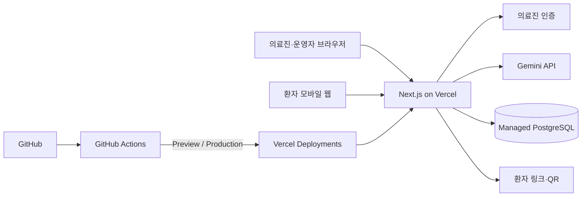

# 웹 애플리케이션 전환 및 배포 설계 제안

- 문서 버전: 0.1
- 작성일: 2026-09-06
- 상태: 제안 — 구현 전 승인 필요

## 1. 제안 결론

Streamlit MVP를 다음 구조로 전환한다.

| 영역 | 제안 기술 | 선택 이유 |
|---|---|---|
| 웹 애플리케이션 | Next.js App Router + TypeScript | 의료진·운영자·환자 화면, API와 PWA 확장에 적합 |
| UI | Tailwind CSS | 모바일 가독성 중심 화면을 빠르게 구성 |
| 서버 API | Next.js Route Handlers | 초기에는 별도 백엔드 서버 없이 단일 프로젝트 유지 |
| 입력 검증 | Zod | AI JSON과 사용자 입력을 동일한 규칙으로 검증 |
| DB | 관리형 PostgreSQL | Vercel의 서버리스 실행 환경에서 영구 데이터 저장 |
| DB 접근 | Drizzle ORM | 비교적 얇은 추상화와 명시적인 SQL 스키마 |
| AI | Gemini 서버 호출 | API Key와 프롬프트를 브라우저에 노출하지 않음 |
| QR | 서버 또는 브라우저 QR 라이브러리 | 환자 URL만 인코딩 |
| 테스트 | Vitest + Playwright | 로직 단위 테스트와 실제 사용자 흐름 테스트 분리 |
| CI/CD | GitHub Actions + Vercel CLI | PR 검증, Preview 배포, main Production 배포 자동화 |

초기 MVP에서는 프런트엔드와 백엔드를 별도 저장소나 서비스로 나누지 않는다. Next.js 프로젝트 하나에 UI, 서버 API, DB 접근을 함께 두되 코드 디렉터리만 역할별로 구분한다.

## 2. 목표 구조



## 3. URL 설계

| URL | 사용자 | 기능 |
|---|---|---|
| `/staff/discharges/new` | 의료진 | 진료 입력, 템플릿 선택, 검토·승인 |
| `/staff/content` | 운영자 | 질환별 안내 콘텐츠 관리 |
| `/staff/discharges` | 의료진 | 발급 이력 조회 |
| `/p/{token}` | 환자 | 승인된 퇴원 안내문 조회 |
| `/api/analyze` | 서버 API | AI 구조화 및 템플릿 추천 |
| `/api/discharges` | 서버 API | 안내문 승인·발급 |
| `/api/content` | 서버 API | 질환 콘텐츠 관리 |

의료진 화면과 환자 화면을 경로 수준에서 분리한다. 환자 URL에는 DB의 순차 ID 대신 충분히 긴 임의 토큰을 사용한다.

## 4. 프로젝트 디렉터리

```text
src/
├── app/
│   ├── staff/
│   │   ├── discharges/
│   │   └── content/
│   ├── p/[token]/
│   └── api/
│       ├── analyze/
│       ├── discharges/
│       └── content/
├── components/
│   ├── staff/
│   └── patient/
├── db/
│   ├── schema.ts
│   └── client.ts
├── lib/
│   ├── ai/
│   ├── auth/
│   ├── qr/
│   └── validation/
└── content/
    └── seed.ts
tests/
├── unit/
└── e2e/
```

## 5. 데이터 저장 변경

Vercel 배포에서는 로컬 SQLite 파일을 운영 DB로 사용하지 않는다. 다음 테이블을 PostgreSQL로 이전한다.

### `disease_templates`

- 질환명과 검색 별칭
- 복약 안내
- 생활·식이·자가관리 안내
- 재내원 위험 신호
- 활성 상태
- 버전, 작성자, 수정자, 수정 시각

### `discharges`

- 내부 ID
- 환자 접근 토큰의 해시
- 의료진이 승인한 안내문 스냅샷
- 사용한 템플릿과 버전
- 승인자와 승인 시각
- 만료 시각 및 취소 시각

환자 URL의 원본 토큰은 DB에 그대로 저장하지 않고 해시하여 비교하는 방식을 우선 검토한다.

## 6. 서버 API 원칙

- Gemini API Key는 서버 환경변수에서만 읽는다.
- AI 응답은 Zod 스키마 검증을 통과해야 한다.
- AI가 반환한 템플릿명은 활성 DB 템플릿과 다시 대조한다.
- 안내문 발급 API는 `의료진 확인 완료` 상태가 아니면 거절한다.
- 환자 조회 API는 승인·미취소·유효기간 조건을 모두 확인한다.
- 환자 응답에는 내부 ID, 의료진 계정정보와 운영 메모를 포함하지 않는다.

## 7. GitHub Actions CI

모든 Pull Request에서 다음 검사를 실행한다.

```text
install
→ lint
→ typecheck
→ unit test
→ production build
```

권장 워크플로 파일:

```text
.github/workflows/ci.yml
```

실패한 검사가 있으면 merge하지 않는다. E2E 테스트는 기본 사용자 흐름이 준비된 뒤 CI에 추가한다.

## 8. GitHub Actions CD

Vercel Git 자동 배포와 GitHub Actions 배포를 동시에 사용하지 않는다. 이 프로젝트는 배포 과정을 명시적으로 관리하기 위해 GitHub Actions 방식을 제안한다.

### Preview

- 조건: Pull Request 생성 또는 업데이트
- 순서: `vercel pull` → `vercel build` → `vercel deploy --prebuilt`
- 결과: PR별 Preview URL 생성

### Production

- 조건: `main` push
- 순서: CI 통과 → Production 환경 pull/build → `vercel deploy --prebuilt --prod`
- 결과: 운영 도메인 갱신

### GitHub Secrets

- `VERCEL_TOKEN`
- `VERCEL_ORG_ID`
- `VERCEL_PROJECT_ID`

애플리케이션의 `DATABASE_URL`, `GEMINI_API_KEY`, 인증 관련 값은 Vercel Environment Variables에서 관리한다.

## 9. 배포 후보 평가

| 후보 | 장점 | 주의점 | MVP 판단 |
|---|---|---|---|
| Vercel | Next.js 배포와 Preview 환경이 단순함 | 영구 파일 DB 부적합, 병원 운영 전 데이터 정책 확인 필요 | 1순위 |
| Cloud Run | 컨테이너와 네트워크 통제가 유연함 | 초기 인프라 설정이 Vercel보다 많음 | 대안 |
| 병원 내부 서버 | 데이터 통제가 쉬움 | 배포·인증서·운영 부담이 큼 | 운영 요구 확인 후 검토 |

Vercel은 비식별 데모와 초기 사용자 검증에 적합하다. 실제 환자 식별정보를 저장하는 운영 환경으로 확정하기 전에는 병원의 보안, 계약, 데이터 저장 위치, 접근통제 기준을 별도로 확인한다.

## 10. Vercel 적용 시 제약

- 로컬 파일 시스템을 영구 DB처럼 사용하지 않는다.
- 관리형 PostgreSQL 연결은 서버리스 환경에 맞는 연결 방식을 사용한다.
- 녹음 파일은 Vercel Function을 거쳐 장기 보관하지 않고, 필요 시 클라이언트에서 객체 저장소로 직접 업로드한다.
- Function 요청·응답 크기 제한 때문에 긴 음성 파일을 API 본문으로 직접 전송하지 않는다.
- 향후 실시간 악화 알림은 영속 상태와 재연결을 고려해 외부 메시징 서비스 또는 관리형 실시간 기능을 사용한다.

## 11. 마이그레이션 순서

### 단계 A: 웹 기반 골격

1. Next.js + TypeScript 프로젝트 생성
2. 현재 환자 안내 화면을 React 컴포넌트로 이전
3. 의료진 입력·검토 화면 이전
4. 데모 데이터로 E2E 흐름 확인

### 단계 B: DB와 콘텐츠 관리

1. PostgreSQL과 Drizzle 스키마 구성
2. 기존 `DISEASE_TEMPLATES`를 seed 데이터로 이전
3. 콘텐츠 관리 CRUD 구현
4. 승인 안내문 스냅샷과 환자 토큰 구현

### 단계 C: AI와 배포

1. Gemini 구조화 API 구현
2. AI 결과 스키마 검증 및 수동 선택 fallback 구현
3. GitHub Actions CI 구성
4. Vercel 프로젝트 연결과 Preview 배포
5. Production 배포 전 보안 체크리스트 검토

## 12. 결정이 필요한 항목

구현 착수 전에 다음 세 항목을 확정한다.

1. Vercel을 데모·MVP 배포 대상으로 확정할지
2. 관리형 PostgreSQL 제공자를 어디로 정할지
3. MVP 의료진 인증을 임시 계정 방식으로 할지 외부 인증 서비스를 사용할지
